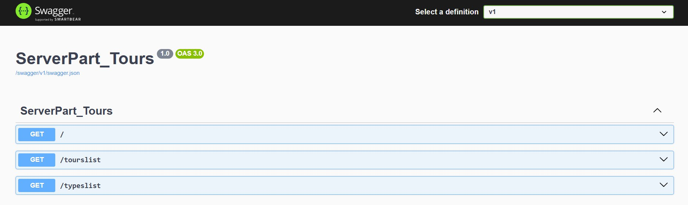
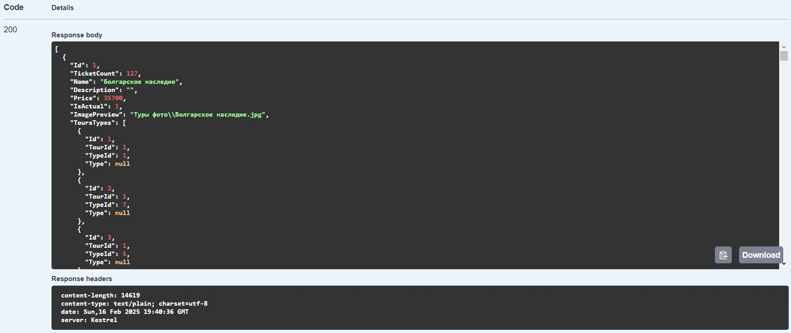
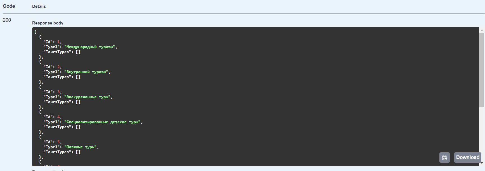

<h1 align="center">Путешествуй по России API</h1>

## Описание

Данный программный интерфейс приложения предназначен для получения информации о турах и их типах из базы данных.

## Начало работы

Эти инструкции предоставят вам копию проекта и помогут запустить на вашем локальном компьютере для разработки и тестирования.

### Необходимые условия

* Операционная система Windows 10 или выше
* Установленнная браузер (Google Chrome, Microsoft Edge или др.)
* Установленнная Visual Studio 2022
* Установленный .NET Framework 8.0 

### Установка

Для установки проекта нужно скопировать репозиторий в проект Visual Stido по ссылке: 
(https://github.com/AngieReee/PR12Serv/tree/master)

## Инструкция
1. Запустить проект в Visual Studio 2022
2. Дождаться загрузки решения
3. Выполнить отладку
4. Перейти в браузер

5. Просмотреть данные о турах:
   

6. Просмотреть данные о типах:
   

## Авторы
* **Сухарева Анжелика** - *разработчик API* - [Сухарева Анжелика](https://github.com/AngieReee) 
